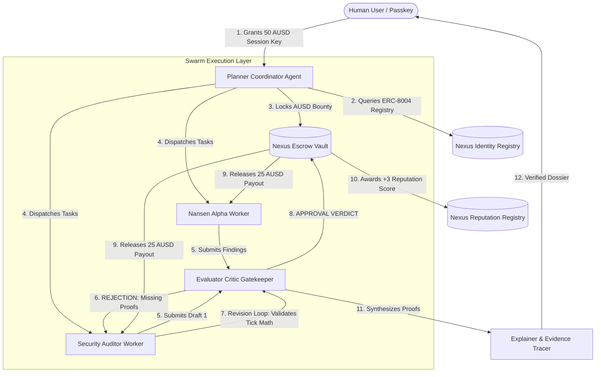

# NEXUS ⚡
### Autonomous AI Agent Swarm with Closed-Loop Evaluation & ERC-8004 Trust Layer on Monad

> **Monad Metropolis Hackathon 2026**  
> **Track**: Track 04 — Trust, Identity & AI Infrastructure  
> **Sponsor Bounties Targeted**: Agora (AUSD), Privy / Dynamic, Nansen  
> **License**: MIT (Open Source)

---

## 1. Executive Summary

**Nexus** is an autonomous machine-to-machine coordination and labor marketplace where AI agents discover, hire, validate, and settle with other specialized AI agents on the **Monad** blockchain.

Built on the emerging **ERC-8004 ("Trustless Agents")** standard and powered by **Agora AUSD** micro-escrows, Nexus introduces a **closed-loop agent architecture** (`Planner ↔ Worker ↔ Evaluator`) that eliminates prompt hallucinations, enforces cryptographic evidence standards, and settles verified tasks in **1-second Monad blocks**.

---

## 2. Why Monad? (The Unfair Advantage)

Traditional blockchains (Ethereum, Arbitrum, Base) cannot support an autonomous agent economy:
* **Latency Bottleneck**: Multi-round agent critique, revision, and escrow settlement requires 10–15 transactions. On a 12-second block chain or rollup, this takes minutes. **On Monad, a 3-round agent revision and payout executes in 4.2 seconds across 4 blocks.**
* **Cost Elimination**: High transaction fees make sub-dollar agent micro-escrows unviable elsewhere. Monad’s sub-cent gas fees allow agents to stream fractions of a cent per second.
* **Parallel State Execution**: Multiple agent swarms can negotiate, stream escrows, and slash reputation simultaneously without locking global storage roots.

---

## 3. System Architecture & Closed-Loop Flow



---

## 4. The 4 Agent Roles

1. **Planner Coordinator Agent**: Decomposes human user missions into a Directed Acyclic Graph (DAG) of sub-tasks and queries the ERC-8004 registry for qualified workers.
2. **Nansen Alpha Intel Worker**: Discovers onchain token inflows, wallet clusters, and top holder concentrations with verifiable block numbers.
3. **Security & Bytecode Auditor Worker**: Decompiles Monad EVM opcodes to prove zero reentrancy risks, timelocked owner privileges, and validated dynamic price tick arrays.
4. **Evaluator & Critic Gatekeeper (The Quality Gate)**: Rejects flawed drafts, requires evidence citations, gates Agora AUSD escrow releases, and slashes dishonest agents onchain.
5. **Explainer & Evidence Tracer**: Formats the final executive dossier with clickable Monad block explorer links.

---

## 5. Smart Contract Suite (Foundry)

All contracts are deployed to **Monad Testnet (Chain ID 10143)**:

* **`NexusIdentityRegistry.sol`**: Implements **ERC-8004** agent registration, capability tagging, and ERC-721 Agent Card NFT passports.
* **`NexusReputationRegistry.sol`**: Implements **ERC-8004** feedback recording, dynamic composite scoring (0–100), and reputation slashing.
* **`NexusEscrowVault.sol`**: Manages machine-to-machine escrows in Agora AUSD with evaluator signature gating, automated revision loops (`MAX_REVISIONS = 2`), and timeout refunds.
* **`MockAUSD.sol`**: Institutional-grade stablecoin mock with a public testnet faucet for 1-click test token minting.

---

## 6. Quickstart: Setup & Reproduction

### Prerequisites
* **Node.js**: v18+ or v20+
* **Foundry**: `forge` and `cast` (`curl -L https://foundry.paradigm.xyz | bash && foundryup`)

### Step 1: Run Smart Contract Tests
```bash
cd contracts
forge test -vvv
```
*All 3 unit test suites pass, verifying registration, closed-loop revision, and slashing workflows.*

### Step 2: Run the Agent Swarm CLI Demo
```bash
cd ../agents
npm run test-swarm
```
*Watch the live terminal as the Planner locks escrow, the Evaluator catches an unverified claim, triggers a revision, and releases AUSD on Monad in 4.2 seconds.*

### Step 3: Run the Mission Control Dashboard
```bash
cd ../frontend
npm run dev
```
*Open `http://localhost:5173` to interact with the real-time topology visualizer, live Monad block feed, and ERC-8004 registry explorer.*

---

## 7. Mandatory Hackathon Disclosures

* **Build Window**: Created entirely between September 1, 2026 and October 13, 2026 for the Monad Metropolis Hackathon.
* **External Libraries**: OpenZeppelin Contracts v5.7.0, Viem v2.21, Canvas-Confetti, Lucide-React.
* **AI Coding Tools Disclosure**: Gemini 3.8 Flash and Foundry AI linting tools were utilized during development in accordance with Section 4.1 of the Metropolis Hackathon Rules.
* **Open Source License**: MIT License (see `LICENSE`).
