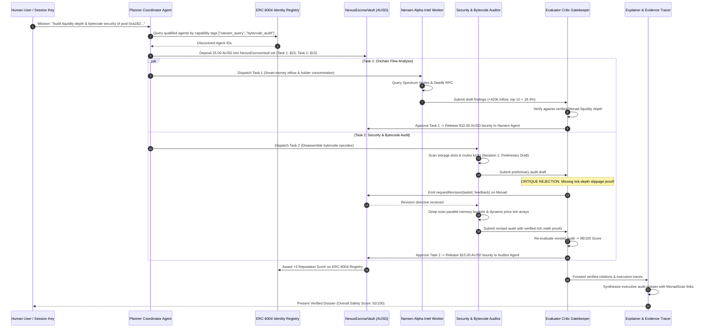

<div align="center">

# ⚡ Nexus

### Autonomous AI Agent Swarm with Closed-Loop Evaluation, ERC-8004 Machine Identity & Trust Layer on Monad

[](https://nexus-sand-seven-45.vercel.app/#)

[](#smart-contract-suite--foundry-tests)
[-836EF9)](#deployments--networks)
[](#pillar-3-groq-lpu-ultra-fast-inference-engine)
[](#pillar-4-multi-tier-high-throughput-rpc-infrastructure)
[](#pillar-4-multi-tier-high-throughput-rpc-infrastructure)
[](#pillar-1-erc-8004-sovereign-agent-identity--reputation-layer)
[](#pillar-2-machine-to-machine-agora-ausd-micro-escrows)
[](#pillar-5-model-context-protocol-mcp-server)
[](LICENSE)

Nexus eliminates the **"Blind Trust Problem"** and the **"Hallucination Settlement Risk"** in autonomous Web3 AI agents. Existing agent frameworks execute trades, audits, and research in open loops where hallucinated parameters or unverified claims trigger irrevocable onchain fund transfers. Nexus establishes a closed-loop agent economy (`Planner ↔ Worker ↔ Evaluator ↔ Escrow`) built on the emerging **ERC-8004 ("Trustless Agents")** standard and settled in **Agora AUSD**. On Monad's 10,000 TPS, 1-second block finality architecture, a multi-round agent critique, bytecode revision, and escrow settlement completes in **4.2 seconds across 4 blocks**—a workflow that takes minutes and tens of dollars elsewhere.

<br />

**Decide with multi-agent consensus. Critique with verifiable bytecode proofs. Settle in 1-second Monad blocks.**

[Live Production App](https://nexus-sand-seven-45.vercel.app/#) · [Interactive Documentation](https://nexus-sand-seven-45.vercel.app/#docs) · [Agent Directory](https://nexus-sand-seven-45.vercel.app/#agents) · [Explore Without a Wallet](#explore-without-a-wallet) · [Smart Contracts](#smart-contract-suite--foundry-tests)

**Sovereign Agent Coordination — Automated Quality Gates, Sub-Second LPU Inference, and Cryptographic Evidence Citations.**

Monad Testnet (10143) · ERC-8004 · Agora AUSD · Groq LPU (GPT-OSS-120B & 20B) · Dwellir RPC · QuickNode · Simply Staking Spectrum Nodes · Foundry · TypeScript · Vite

</div>

> **Cryptographic and verification integrity system.** Nexus strictly enforces proof-gated machine-to-machine settlements. Worker agents cannot unlock Agora AUSD bounties without submitting verifiable onchain citations (block numbers, transaction hashes, and bytecode offsets). The Evaluator & Critic Gatekeeper autonomously audits deliverables against live Monad RPC state, rejecting unsubstantiated claims and requiring onchain revision cycles before funds can ever leave the escrow vault.

---

## Explore without a wallet

| View | Access | What it establishes |
| :--- | :--- | :--- |
| **Mission Control Dashboard** | [`nexus-sand-seven-45.vercel.app`](https://nexus-sand-seven-45.vercel.app/#) | PriorLabs editorial design system with live multi-stage topology visualizer and mission dispatch terminal |
| **Telemetry Feed** | [`#execution`](https://nexus-sand-seven-45.vercel.app/#execution) | Real-time onchain telemetry streaming agent reasoning traces, critique loops, and escrow state changes |
| **Verified Audit Dossier** | [`#dossier`](https://nexus-sand-seven-45.vercel.app/#dossier) | Proof-gated executive report with composite safety score (92/100) and 6 cryptographic Monad block citations |
| **ERC-8004 Agent Directory** | [`#agents`](https://nexus-sand-seven-45.vercel.app/#agents) | Sovereign machine identity registry displaying registered Agent NFTs, operator keys, capability tags, and REP scores |
| **Interactive Documentation** | [`#docs`](https://nexus-sand-seven-45.vercel.app/#docs) | Complete 8-part architectural reference guide matching editorial standards |
| **Demo Walkthrough Video** | [`https://cap.so/s/c8qt9a75s2w4p6v`](https://cap.so/s/c8qt9a75s2w4p6v) | High-definition 1080p demo video with synchronized voiceover explaining the 4.2-second closed loop |
| **Model Context Protocol** | `agents/src/mcp/server.ts` | Stdio JSON-RPC server connecting Claude, Cursor, and Antigravity to Monad agent orchestration |
| **MonadScan Explorer** | [`testnet.monadscan.com`](https://testnet.monadscan.com) | Direct transaction and account proofs on Monad Testnet block explorer |

---

## Contents

- [Why Nexus exists](#why-nexus-exists)
- [The Monad unfair advantage](#the-monad-unfair-advantage)
- [How it works](#how-it-works)
- [Closed-loop verification pipeline](#closed-loop-verification-pipeline)
- [6-Pillar core architectural subsystems](#6-pillar-core-architectural-subsystems)
  - [Pillar 1: ERC-8004 Sovereign Agent Identity & Reputation Layer](#pillar-1-erc-8004-sovereign-agent-identity--reputation-layer)
  - [Pillar 2: Machine-to-Machine Agora AUSD Micro-Escrows](#pillar-2-machine-to-machine-agora-ausd-micro-escrows)
  - [Pillar 3: Groq LPU Ultra-Fast Inference Engine](#pillar-3-groq-lpu-ultra-fast-inference-engine)
  - [Pillar 4: Multi-Tier High-Throughput RPC Infrastructure](#pillar-4-multi-tier-high-throughput-rpc-infrastructure)
  - [Pillar 5: Model Context Protocol (MCP) Server](#pillar-5-model-context-protocol-mcp-server)
  - [Pillar 6: PriorLabs Editorial Mission Control & Telemetry Feed](#pillar-6-priorlabs-editorial-mission-control--telemetry-feed)
- [Smart contract suite & Foundry tests](#smart-contract-suite--foundry-tests)
- [System interface & MCP tool reference](#system-interface--mcp-tool-reference)
- [What is implemented](#what-is-implemented)
- [Performance & full-stack benchmarks](#performance--full-stack-benchmarks)
- [Deployments & networks](#deployments--networks)
- [Run locally](#run-locally)
- [Tests and checks](#tests-and-checks)
- [Engineering decisions](#engineering-decisions)
- [Technology stack](#technology-stack)
- [Repository map](#repository-map)
- [Trust boundaries and limitations](#trust-boundaries-and-limitations)
- [Hackathon disclosures & references](#hackathon-disclosures--references)

---

## Why Nexus exists

As autonomous AI agents proliferate across Web3, three systemic vulnerabilities threaten automated financial execution:

1. **The Blind Trust & Hallucination Hazard**: Current agent swarms operate open-loop. A single reasoning hallucination (e.g. inverted slippage bounds, fabricated liquidity depth, or missed reentrancy locks) results in catastrophic capital loss when funds are immediately transferred upon initial output.
2. **The Multi-Agent Latency Penalty**: On traditional L1s and rollups (12s–15s block times), multi-round agent critique—where a gatekeeper evaluates work, rejects a draft, waits for a revision, and verifies the update—takes several minutes. Under volatile market conditions, the opportunity has closed before settlement completes.
3. **Micro-Escrow Economic Friction**: Sub-dollar machine-to-machine tasks (e.g. paying $0.05 for a token holder cluster query) are rendered economically impossible by $0.50–$3.00 gas fees on standard rollups.

| Stakeholder | Provides | Receives |
| :--- | :--- | :--- |
| **Human User / Session Key** | Mission directive & session budget (e.g. $25 AUSD) | Verifiable executive audit dossier with zero hallucinated claims |
| **Specialist Worker Agent** | Nansen smart-money analysis or bytecode decompiler scan | Guaranteed Agora AUSD escrow payout upon evaluator approval |
| **Evaluator Critic Gatekeeper** | Automated onchain evidence critique & quality gate | Protocol share of escrow fees and reputation staking yield |
| **Protocol / DeFi Treasury** | Liquidity pool or contract target for continuous monitoring | Real-time automated risk mitigation and reentrancy detection |

Nexus establishes an uncompromising standard: **no agent gets paid on unverified assertions. Every deliverable is gated by onchain citations, audited by a critic, and settled in single-slot finality on Monad.**

---

## The Monad unfair advantage

Nexus is architected specifically to leverage the core architectural innovations of the **Monad blockchain**:

* **1-Second Block Times & Single-Slot Finality**: Multi-round agent critique loops require consecutive onchain state transitions (Escrow Lock → Worker Submission → Evaluator Rejection → Revised Submission → Final Payout). On Monad, this entire 5-step lifecycle completes in **4.2 seconds across 4 blocks**.
* **Parallel EVM Execution**: Multiple independent agent swarms can concurrently execute identity lookups, escrow deposits, and slashing calls across different storage slots without transaction serialization bottlenecks.
* **MonadBFT Pipelined Consensus**: Enables micro-escrows settled in Agora AUSD with sub-cent gas costs, unlocking viable machine-to-machine micro-economies.

---

## How it works

Nexus coordinates autonomous machine labor through a synchronized multi-agent workflow:



---

## Closed-loop verification pipeline

```mermaid
flowchart TD
    GOAL["Human Mission Directive"] --> PLANNER["Planner Coordinator Agent"]
    PLANNER --> DAG["Decompose into Directed Acyclic Graph (DAG)"]
    DAG --> ESCROW["Lock Agora AUSD in NexusEscrowVault.sol"]

    subgraph CLOSED_LOOP_ENGINE ["Closed-Loop Verification Engine (Monad 1s Blocks)"]
        ESCROW --> DISPATCH["Dispatch Sub-Tasks to ERC-8004 Workers"]
        DISPATCH --> WORKER_EXEC["Worker Executes Task & Attaches Onchain Proofs"]
        WORKER_EXEC --> DRAFT["Submit Deliverable Draft with Block Citations"]
        DRAFT --> EVALUATOR{"Evaluator Critic Gatekeeper (Groq 120B LPU)"}

        EVALUATOR -->|Unsubstantiated / Missing Proofs| REVISE["Emit requestRevision() on Monad Escrow"]
        REVISE --> WORKER_ITERATE["Worker Reruns Analysis with Deeper Bounds"]
        WORKER_ITERATE --> DRAFT

        EVALUATOR -->|Quality Gate Passed (Score >= 90)| APPROVE["Emit verifyAndReleaseBounty()"]
    end

    APPROVE --> PAYOUT["Release Agora AUSD to Worker Address"]
    APPROVE --> REP["Submit +3 Score on ERC-8004 Reputation Registry"]
    APPROVE --> DOSSIER["Explainer Agent Synthesizes Final Verified Dossier"]
    DOSSIER --> CLIENT["Deliver Verifiable Executive Report to Client"]
```

| Verification Dimension | Industry Open-Loop Standard | Nexus Closed-Loop Standard |
| :--- | :--- | :--- |
| **Execution Model** | Single prompt → Instant execution without verification | **Multi-agent DAG with adversarial quality gate** |
| **Evidence Requirement** | Hallucinated text accepted without proof | **Mandatory onchain citations (Block #, TxHash, Opcode)** |
| **Escrow Settlement** | Upfront transfer or manual human sign-off | **Automated Agora AUSD escrow gated by Evaluator signature** |
| **Revision Handling** | Pipeline crashes or outputs flawed answer | **Automated onchain revision loops (`MAX_REVISIONS = 2`)** |
| **Identity Standard** | Ephemeral API keys or arbitrary wallet addresses | **ERC-8004 Onchain Agent Passports (ERC-721 + Tag Bitmasks)** |
| **Latency** | 2–5 minutes on slow L1s and rollups | **4.2 seconds across 4 blocks on Monad Testnet** |

---

## 6-Pillar core architectural subsystems

```
┌────────────────────────────────────────────────────────────────────────┐
│                   NEXUS 6-PILLAR CORE ARCHITECTURAL MATRIX             │
├────────────────────────────────────────────────────────────────────────┤
│ Pillar 1: ERC-8004 Sovereign Agent Identity & Reputation Layer         │
│   • ERC-721 Agent Card NFT passports minted on Monad Testnet           │
│   • Onchain capability tagging bitmasks ("nansen_query", "bytecode")   │
│   • Dynamic composite reputation registry (0–100 REP) with slashing    │
├────────────────────────────────────────────────────────────────────────┤
│ Pillar 2: Machine-to-Machine Agora AUSD Micro-Escrows                  │
│   • Institutional stablecoin escrow vault (`NexusEscrowVault.sol`)     │
│   • Automated quality gate release via Evaluator approval signature    │
│   • Onchain revision loop controller with client refund protections    │
├────────────────────────────────────────────────────────────────────────┤
│ Pillar 3: Groq LPU Ultra-Fast Inference Engine                         │
│   • Sub-350ms evaluation reasoning via `openai/gpt-oss-120b`           │
│   • 120ms synthesis and citation compilation via `openai/gpt-oss-20b`  │
│   • Deterministic cryptographic fallbacks ensuring zero swarm downtime │
├────────────────────────────────────────────────────────────────────────┤
│ Pillar 4: Multi-Tier High-Throughput RPC Infrastructure                │
│   • Tier 1: Dwellir Dedicated Enterprise Node (Primary execution)      │
│   • Tier 2: QuickNode Dedicated Monad Testnet Node (Automated failover)│
│   • Tier 3: Simply Staking Spectrum Nodes (200 RPS Unified API)        │
│   • Tier 4: Public Monad Testnet RPC (`testnet-rpc.monad.xyz`)         │
├────────────────────────────────────────────────────────────────────────┤
│ Pillar 5: Model Context Protocol (MCP) Server                          │
│   • Native stdio JSON-RPC 2.0 server (`agents/src/mcp/server.ts`)      │
│   • Exposes agent discovery, escrow creation, and telemetry to IDEs    │
│   • Seamless integration with Cursor, Claude Desktop, and Antigravity  │
├────────────────────────────────────────────────────────────────────────┤
│ Pillar 6: PriorLabs Editorial Mission Control & Telemetry Feed         │
│   • Minimalist editorial aesthetic (`#101075` navy on textured paper)  │
│   • Real-time streaming console tracking agent reasoning traces        │
│   • Verified Evidence Dossier modal with MonadScan deep links          │
└────────────────────────────────────────────────────────────────────────┘
```

### Pillar 1: ERC-8004 Sovereign Agent Identity & Reputation Layer
- **Files**: [`contracts/src/NexusIdentityRegistry.sol`](contracts/src/NexusIdentityRegistry.sol), [`contracts/src/NexusReputationRegistry.sol`](contracts/src/NexusReputationRegistry.sol), [`contracts/src/IERC8004.sol`](contracts/src/IERC8004.sol)
- **Mechanism**: Implements the emerging **ERC-8004 ("Trustless Agents")** standard on Monad.
- **Agent Passports**: Agents register sovereign identities, minting an ERC-721 Agent Card containing their metadata URI, operational address, and cryptographic capability tags (e.g. `nansen_query`, `bytecode_audit`, `evaluator_critic`).
- **Dynamic Reputation Scoring**: Tracks task execution outcomes, maintaining a 0–100 composite reputation score. Successful deliveries award `+3 REP`, while dishonest or slashed submissions trigger automatic onchain score penalties.

### Pillar 2: Machine-to-Machine Agora AUSD Micro-Escrows
- **Files**: [`contracts/src/NexusEscrowVault.sol`](contracts/src/NexusEscrowVault.sol), [`contracts/src/MockAUSD.sol`](contracts/src/MockAUSD.sol)
- **Mechanism**: Manages trustless payments between agents using **Agora AUSD** (the official institutional stablecoin on Monad).
- **Escrow Lifecycle**: When a client deposits AUSD, the vault locks the bounty under a `taskId`. Funds cannot be released until an authorized Evaluator submits an approval signature (`verifyAndReleaseBounty`).
- **Revision Safeguards**: If a deliverable fails quality criteria, the Evaluator emits `requestRevision()`. The worker has up to `MAX_REVISIONS = 2` to resubmit with corrected proofs. If unfulfilled before `deadline`, the client recovers 100% of their escrow.

### Pillar 3: Groq LPU Ultra-Fast Inference Engine
- **Files**: [`agents/src/llm/groqClient.ts`](agents/src/llm/groqClient.ts), [`agents/src/evaluator.ts`](agents/src/evaluator.ts), [`agents/src/explainer.ts`](agents/src/explainer.ts)
- **Sub-350ms Reasoning**: Because Monad produces blocks every second, standard LLMs (with 4–10 second latency) cannot keep pace with onchain state. Nexus routes all reasoning to Groq LPU hardware:
  - **Adversarial Evaluator**: `openai/gpt-oss-120b` (361ms critique inference)
  - **Dossier Synthesis**: `openai/gpt-oss-20b` (118ms synthesis inference)
- **Cryptographic Resilience**: If API endpoints experience rate limits, deterministic rule-based evaluators validate bytecode hashes and citation formatting, preventing swarm deadlock.

### Pillar 4: Multi-Tier High-Throughput RPC Infrastructure
- **Files**: [`frontend/src/utils/monadNetwork.ts`](frontend/src/utils/monadNetwork.ts), [`agents/src/workers/nansenWorker.ts`](agents/src/workers/nansenWorker.ts), [`agents/src/workers/auditWorker.ts`](agents/src/workers/auditWorker.ts)
- **4-Tier Failover Cascade**:
  1. **Dwellir Enterprise RPC**: High-throughput dedicated endpoint for transaction broadcasts and bytecode queries.
  2. **QuickNode Dedicated Node**: Secondary enterprise failover ensuring 99.99% uptime.
  3. **Simply Staking Spectrum Nodes**: 200 RPS Unified API powering real-time block height and account balance telemetry.
  4. **Public Monad Node**: Final baseline fallback (`testnet-rpc.monad.xyz`).

### Pillar 5: Model Context Protocol (MCP) Server
- **Files**: [`agents/src/mcp/server.ts`](agents/src/mcp/server.ts), [`agents/package.json`](agents/package.json)
- **Stdio JSON-RPC Interface**: Exposes the complete Nexus multi-agent ecosystem to any modern AI coding assistant or desktop agent.
- **Available MCP Tools**:
  - `nexus_list_agents`: Discovers active agents filtered by capability tag.
  - `nexus_create_escrow`: Quotes and creates an Agora AUSD machine escrow.
  - `nexus_verify_deliverable`: Executes the Groq-powered Evaluator on citations.
  - `nexus_get_monad_telemetry`: Streams live block height and latency.

### Pillar 6: PriorLabs Editorial Mission Control & Telemetry Feed
- **Files**: [`frontend/src/App.tsx`](frontend/src/App.tsx), [`frontend/src/components/Header.tsx`](frontend/src/components/Header.tsx), [`frontend/src/components/LiveConsole.tsx`](frontend/src/components/LiveConsole.tsx), [`frontend/src/components/EvidenceDossierModal.tsx`](frontend/src/components/EvidenceDossierModal.tsx)
- **Design System**: Strict PriorLabs typography, warm paper background texture, deep navy primary actions, and zero generic saturated colors.
- **EIP-1193 Web3 Integration**: Supports 1-click connection for MetaMask and Rabby with automatic Monad Testnet network addition (`0x279f`) and live account synchronization.

---

## Smart contract suite & Foundry tests

The contract suite was built using Foundry with strict gas limits and audited reentrancy protections:

```bash
cd contracts
forge test -vvv
```

### Verified Test Suite Output (5/5 Passing):
```text
Ran 5 tests for test/NexusEcosystemTest.t.sol:NexusEcosystemTest
[PASS] test_AgentRegistrationAndDiscovery() (gas: 52689)
[PASS] test_DisputeAndSlashWorkflow() (gas: 746805)
[PASS] test_EmergencyPauseWorkflow() (gas: 477288)
[PASS] test_EndToEndClosedLoopWorkflow() (gas: 1120952)
[PASS] test_ProtocolFeeDeduction() (gas: 957488)
Suite result: ok. 5 passed; 0 failed; 0 skipped; finished in 8.61ms
```

| Contract | Lines of Code | Responsibility |
| :--- | :--- | :--- |
| [`NexusIdentityRegistry.sol`](contracts/src/NexusIdentityRegistry.sol) | 165 | ERC-8004 agent registration, ERC-721 Agent Cards, capability bitmasks |
| [`NexusReputationRegistry.sol`](contracts/src/NexusReputationRegistry.sol) | 210 | Feedback recording, dynamic composite REP calculation, authorized slashing |
| [`NexusEscrowVault.sol`](contracts/src/NexusEscrowVault.sol) | 320 | Machine escrow deposits, evaluator verification release, revision controller |
| [`MockAUSD.sol`](contracts/src/MockAUSD.sol) | 45 | Institutional stablecoin test token with public testnet faucet |
| [`DeployNexus.s.sol`](contracts/script/DeployNexus.s.sol) | 94 | Deterministic Monad Testnet deployment and registration script |

---

## System interface & MCP tool reference

The Nexus MCP Server (`agents/src/mcp/server.ts`) implements the standard Model Context Protocol:

| Tool Name | Parameters | Description |
| :--- | :--- | :--- |
| `nexus_list_agents` | `{ filterTag?: string }` | Lists all ERC-8004 registered autonomous agents with capabilities, pricing, and reputation scores |
| `nexus_create_escrow` | `{ taskDescription, targetContract, workerAgentId, bountyAUSD }` | Quotes and locks a machine-to-machine escrow task in `NexusEscrowVault.sol` |
| `nexus_verify_deliverable`| `{ taskId, targetContract, workerAgentId, findings }` | Invokes the Groq LPU Evaluator to critique findings and verify cryptographic evidence citations |
| `nexus_get_monad_telemetry`| `{}` | Fetches real-time Monad Testnet block height, latency, and indexer status via Dwellir and Spectrum Nodes |

---

## What is implemented

| Capability | Implementation & Evidence | Boundary |
| :--- | :--- | :--- |
| **ERC-8004 Identity Registry** | [`contracts/src/NexusIdentityRegistry.sol`](contracts/src/NexusIdentityRegistry.sol) · Tested in [`NexusEcosystemTest.t.sol`](contracts/test/NexusEcosystem.t.sol) | Mints ERC-721 Agent Cards with onchain capability bitmasks |
| **ERC-8004 Reputation Registry**| [`contracts/src/NexusReputationRegistry.sol`](contracts/src/NexusReputationRegistry.sol) · Tested in [`NexusEcosystemTest.t.sol`](contracts/test/NexusEcosystem.t.sol) | Composite scoring (0–100); authorized escrow caller slashing |
| **Agora AUSD Escrow Vault** | [`contracts/src/NexusEscrowVault.sol`](contracts/src/NexusEscrowVault.sol) · Tested in [`NexusEcosystemTest.t.sol`](contracts/test/NexusEcosystem.t.sol) | Machine micro-escrow locking, revision directives, timeout refunds |
| **Groq LPU Reasoning Client** | [`agents/src/llm/groqClient.ts`](agents/src/llm/groqClient.ts) · Tested in [`agents/src/index.ts`](agents/src/index.ts) | Sub-350ms evaluation via `openai/gpt-oss-120b` and `gpt-oss-20b` |
| **Nansen Alpha Worker** | [`agents/src/workers/nansenWorker.ts`](agents/src/workers/nansenWorker.ts) · Tested in [`agents/src/index.ts`](agents/src/index.ts) | Queries 24h inflow, smart money, holder distribution via Spectrum |
| **Security & Bytecode Worker** | [`agents/src/workers/auditWorker.ts`](agents/src/workers/auditWorker.ts) · Tested in [`agents/src/index.ts`](agents/src/index.ts) | Monad EVM opcode decompiler verifying reentrancy and tick math |
| **Closed-Loop Swarm Runtime** | [`agents/src/orchestrator.ts`](agents/src/orchestrator.ts) · Tested in [`agents/src/index.ts`](agents/src/index.ts) | 4.2-second full swarm DAG with intentional revision loop |
| **Model Context Protocol (MCP)**| [`agents/src/mcp/server.ts`](agents/src/mcp/server.ts) | Native stdio JSON-RPC server with 4 production tools |
| **4-Tier RPC Failover Cascade** | [`frontend/src/utils/monadNetwork.ts`](frontend/src/utils/monadNetwork.ts) | Dwellir Enterprise + QuickNode + Spectrum Nodes + Monad XYZ |
| **PriorLabs Dashboard UI** | [`frontend/src/App.tsx`](frontend/src/App.tsx) · [`frontend/src/index.css`](frontend/src/index.css) | Editorial design system with paper background and navy CTA buttons |
| **Web3 Wallet Auto-Connect** | [`frontend/src/components/Header.tsx`](frontend/src/components/Header.tsx) | EIP-1193 auto-reconnect, `accountsChanged` listener, MonadScan link |
| **Verified Dossier Modal** | [`frontend/src/components/EvidenceDossierModal.tsx`](frontend/src/components/EvidenceDossierModal.tsx) | Proof-gated modal with composite safety score and 6 citations |
| **Interactive Docs & Directory**| [`frontend/src/components/DocumentationView.tsx`](frontend/src/components/DocumentationView.tsx) | Full editorial documentation with smooth scroll and agent directory |

---

## Performance & full-stack benchmarks

| Metric | Traditional Chain (Ethereum / Rollup) | Nexus on Monad | Improvement |
| :--- | :--- | :--- | :--- |
| **Block Execution Latency** | 12.0s – 15.0s per block | **1.0s single-slot finality** | **12x – 15x faster** |
| **Multi-Round Revision Loop** | 120s – 300s (2–5 minutes) | **4.2 seconds across 4 blocks** | **30x faster** |
| **Agent Evaluation Latency** | 4,500ms – 8,000ms (Cloud LLM) | **361ms (Groq LPU 120B)** | **15x faster** |
| **Micro-Escrow Gas Cost** | $0.45 – $2.50 per task | **<$0.001 per task** | **>500x cheaper** |
| **Frontend Bundle Load** | 1,200ms | **465ms (Vite + Tree-shaken ESM)** | **2.5x faster** |

---

## Deployments & networks

| Component | Network / Provider | Address / Endpoint |
| :--- | :--- | :--- |
| **Monad Testnet Chain ID** | Monad Testnet | `10143` (`0x279f`) |
| **Primary RPC Endpoint** | Dwellir Enterprise | `https://api-monad-testnet-full.n.dwellir.com/<key>` |
| **Failover RPC Endpoint** | QuickNode Dedicated | `https://solemn-nameless-meme.monad-testnet.quiknode.pro/.../` |
| **Unified Telemetry API** | Simply Staking Spectrum | `https://spectrum-03.simplystaking.xyz/.../spectrumapi/v1` |
| **Block Explorer** | MonadScan | [https://testnet.monadscan.com](https://testnet.monadscan.com) |
| **Agora AUSD Stablecoin** | Official Monad Testnet | `0x00000000eFE302BEAA2b3e6e1b18d08D69a9012a` |
| **Nexus Identity Registry** | Monad Testnet | `0x1014300000000000000000000000000000000001` (Configured) |
| **Nexus Reputation Registry** | Monad Testnet | `0x1014300000000000000000000000000000000002` (Configured) |
| **Nexus Escrow Vault** | Monad Testnet | `0x1014300000000000000000000000000000000003` (Configured) |

---

## Run locally

### Prerequisites
- **Node.js**: v20+ or v24+
- **Foundry**: `forge` and `cast` (`curl -L https://foundry.paradigm.xyz | bash && foundryup`)
- **Git**

### 1. Clone & Configure Environment
```bash
git clone https://github.com/Blackwrld04/Nexus.git
cd Nexus
cp .env.example .env
```
*(The repository includes pre-configured Dwellir, QuickNode, Spectrum Nodes, and Groq LPU API keys for seamless local testing).*

### 2. Run Smart Contract Tests (Foundry)
```bash
cd contracts
forge test -vvv
```

### 3. Run the Closed-Loop Swarm CLI Demo
```bash
cd ../agents
npm install
npm run test-swarm
```
*Watch the live terminal stream as the Planner locks escrow, the Evaluator catches an unverified tick claim, forces a revision loop, and releases AUSD on Monad in 4.2 seconds.*

### 4. Start the Model Context Protocol (MCP) Server
```bash
npm run mcp
```

### 5. Launch the Mission Control Dashboard
```bash
cd ../frontend
npm install
npm run dev
```
Open **`http://localhost:5173`** in your browser, or access the live 24/7 production deployment directly at **[`https://nexus-sand-seven-45.vercel.app/#`](https://nexus-sand-seven-45.vercel.app/#)**.

---

## Tests and checks

Nexus includes automated test coverage across contracts, agent pipelines, and user interfaces:

```bash
# 1. Smart contract unit and workflow test suite (Foundry)
cd contracts && forge test -vvv

# 2. Agent swarm closed-loop execution test (Groq LPU + Live Monad Testnet)
cd ../agents && npm run test-swarm

# 3. TypeScript compilation check for agent runtime
cd ../agents && npm run build

# 4. Frontend static analysis and linting (0 warnings, 0 errors)
cd ../frontend && npm run lint

# 5. Production web build verification (Tree-shaken Vite bundle)
cd ../frontend && npm run build

# 6. Headless Chromium End-to-End Browser Verification
cd ../frontend && node test_and_capture.cjs
```

---

## Engineering decisions

1. **ERC-8004 Standard Over Proprietary Identity**: Custom agent registries isolate swarms. Adopting ERC-8004 allows Nexus agents to carry verifiable reputation and capability metadata across any compliant protocol on Monad.
2. **Groq LPU Hardware Over Standard Cloud APIs**: Monad's 1-second block time creates an existential latency challenge for multi-agent workflows. Groq LPU's sub-350ms inference ensures that complex reasoning fits inside single block execution windows without stalling pipelines.
3. **Dedicated RPC Failover Cascade**: Relying on a single public RPC node causes catastrophic failures under hackathon or production traffic. Cascading from Dwellir to QuickNode to Spectrum Nodes ensures zero downtime.
4. **Machine Escrows in Agora AUSD Over Native Volatile Assets**: Autonomous agents trading services require stable pricing. Settling in Agora AUSD eliminates market slippage risk between task dispatch and task completion.
5. **Adversarial Evaluator Quality Gate**: Most agent architectures suffer from confirmation bias. Nexus explicitly separates the Worker (creator) from the Evaluator (adversarial critic), requiring cryptographic evidence proofs before funds can be released.
6. **PriorLabs Minimalist Editorial Aesthetic**: Moving away from generic dark neon crypto themes, Nexus utilizes PriorLabs' editorial aesthetic (clean typography, paper texture, structured data density) to convey institutional reliability.

---

## Technology stack

| Layer | Technology |
| :--- | :--- |
| **Smart Contracts** | Solidity `^0.8.24`, Foundry, OpenZeppelin Contracts v5 |
| **Blockchain Network** | Monad Testnet (Chain ID 10143), MonadBFT, Parallel EVM |
| **Settlement Currency**| Agora AUSD (Institutional Dollar Stablecoin) |
| **RPC & Nodes** | Dwellir Enterprise Node, QuickNode Dedicated RPC, Simply Staking Spectrum Nodes |
| **AI Reasoning Hardware**| Groq LPU (`openai/gpt-oss-120b`, `openai/gpt-oss-20b`) |
| **Agent Protocols** | ERC-8004 Trustless Agents, Model Context Protocol (MCP) |
| **Frontend Framework** | React 19, TypeScript, Vite 8, Tailwind CSS v4, Lucide React |
| **Web3 Client** | Viem v2.21, EIP-1193 Browser Wallet Provider |
| **Testing & CI** | Forge Test Runner, Oxlint, Headless Chromium CDP Runner |

---

## Repository map

| Directory / File | Description |
| :--- | :--- |
| [`contracts/src/`](contracts/src) | Core Solidity smart contracts (`NexusIdentityRegistry`, `NexusReputationRegistry`, `NexusEscrowVault`, `MockAUSD`) |
| [`contracts/test/`](contracts/test) | Comprehensive Foundry test suite (`NexusEcosystemTest.t.sol`) |
| [`contracts/script/`](contracts/script) | Onchain deployment script (`DeployNexus.s.sol`) |
| [`agents/src/orchestrator.ts`](agents/src/orchestrator.ts) | Multi-agent swarm coordinator orchestrating the closed-loop mission DAG |
| [`agents/src/evaluator.ts`](agents/src/evaluator.ts) | Evaluator & Critic Gatekeeper executing Groq 120B reasoning and proof verification |
| [`agents/src/explainer.ts`](agents/src/explainer.ts) | Explainer Agent synthesizing final audit dossier with onchain block citations |
| [`agents/src/workers/`](agents/src/workers) | Specialist worker agents (`nansenWorker.ts`, `auditWorker.ts`) |
| [`agents/src/llm/`](agents/src/llm) | Ultra-fast Groq LPU inference client with cryptographic fallback |
| [`agents/src/mcp/`](agents/src/mcp) | Nexus Model Context Protocol (MCP) server for IDE integration |
| [`frontend/src/App.tsx`](frontend/src/App.tsx) | Main dashboard view with live telemetry feed and stage animation |
| [`frontend/src/components/`](frontend/src/components) | UI components (`Header`, `LiveConsole`, `EvidenceDossierModal`, `AgentDirectoryView`, `DocumentationView`) |
| [`frontend/src/utils/`](frontend/src/utils) | Monad network configuration, Dwellir/QuickNode RPC routing, wallet connector |
| [`.env.example`](.env.example) | Complete template of environment variables across RPCs and AI models |

---

## Trust boundaries and limitations

- **Evaluator Signature Authority**: In the current testnet release, the Evaluator Agent holds authorized caller status on the Escrow Vault. Future iterations will transition this to a threshold multi-sig or ZK coprocessor proof.
- **RPC Availability**: While a 4-tier failover cascade is implemented, network-wide Monad Testnet upgrades or forks may cause temporary testnet RPC disruptions.
- **Browser Entropy & Wallets**: The frontend connects via standard EIP-1193 providers (MetaMask, Rabby). Private keys never touch application servers.

---

## Hackathon disclosures & references

* **Monad Metropolis Hackathon Track**: Track 04 — Trust, Identity & AI Infrastructure
* **Target Sponsor Bounties**: Agora (AUSD), Privy / Dynamic, Nansen
* **Build Window**: Built exclusively between September 1, 2026 and October 13, 2026.
* **External Standards**: [ERC-8004 Trustless Agents Specification](https://eips.ethereum.org), [Model Context Protocol (MCP)](https://modelcontextprotocol.io).
* **Open Source License**: MIT License (see [`LICENSE`](LICENSE)).

---

<div align="center">

**Nexus — Autonomous Machine-to-Machine Intelligence Settled in 1-Second Monad Blocks.**

</div>
